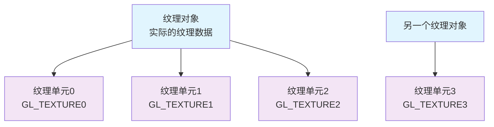
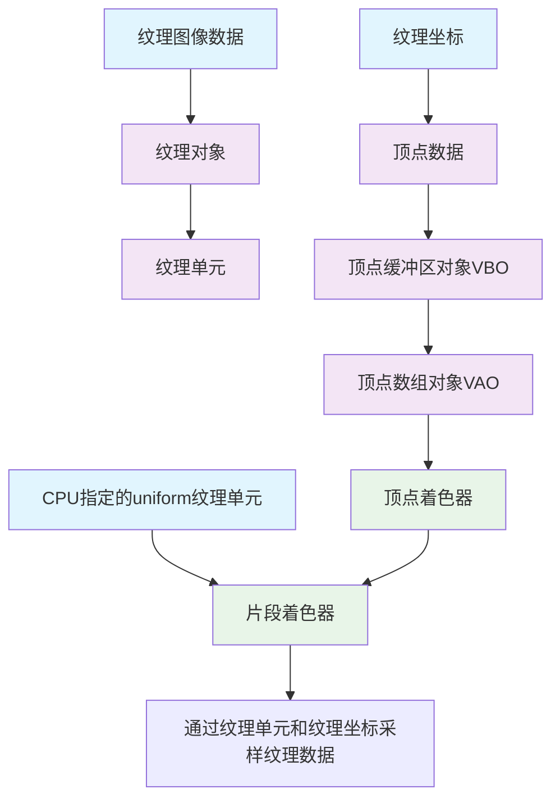

## CPU中的纹理数据
纹理数据存储在CPU中，通过`stbi_load`函数加载。
随后通过`glTexImage2D`函数传入给GPU的纹理对象中，之后可以通过`stbi_image_free`释放掉cpu的数据。


## 纹理对象
显存中存储实际纹理数据的容器，内容包含：
1. 像素数据：通过`glTexImage2D`函数传入
2. 可能的多个mipmap层级：通过`glGenerateMipmap`函数生成
1. 纹理参数：通过`glTexParameteri`函数设置
2. 纹理元数据（尺寸、格式等）

**生命周期**：通过 `glGenTextures` 创建，`glDeleteTextures` 删除，通过unsigned int的ID索引

## 纹理目标
一些纹理类型，告诉OpenGL如何解释纹理数据，片段着色器中的采样器类型必须与纹理目标匹配（如 sampler2D 对应 GL_TEXTURE_2D）
`glBindTexture(GL_TEXTURE_2D, texture1);`

**类型：**
GL_TEXTURE_1D - 一维纹理
GL_TEXTURE_2D - 二维纹理（最常用）
GL_TEXTURE_3D - 三维纹理
GL_TEXTURE_CUBE_MAP - 立方体贴图
GL_TEXTURE_1D_ARRAY - 一维纹理数组
GL_TEXTURE_2D_ARRAY - 二维纹理数组
GL_TEXTURE_CUBE_MAP_ARRAY - 立方体贴图数组
GL_TEXTURE_2D_MULTISAMPLE - 多重采样二维纹理
GL_TEXTURE_2D_MULTISAMPLE_ARRAY - 多重采样二维纹理数组
GL_TEXTURE_BUFFER - 缓冲纹理


## 纹理单元
纹理单元是GPU中的特殊寄存器/状态机，如：GL_TEXTURE0, GL_TEXTURE1，着色器通过纹理单元访问纹理对象。
每个纹理单元拥有多个不同纹理目标类型的纹理位置可供绑定，如：
```c++
glActiveTexture(GL_TEXTURE0);                       // 选第 0 号插排
glBindTexture(GL_TEXTURE_2D,           woodId);     // 单元0-2D
glBindTexture(GL_TEXTURE_CUBE_MAP,     skyId);      // 单元0-Cube
glBindTexture(GL_TEXTURE_3D,           volId);      // 单元0-3D
```
```glsl
uniform sampler2D       texWood;   // 取单元0-GL_TEXTURE_2D
uniform samplerCube     texSky;    // 取单元0-GL_TEXTURE_CUBE_MAP
uniform sampler3D       texVol;    // 取单元0-GL_TEXTURE_3D
```
1. 选择纹理单元：`glActiveTexture` // 默认GL_TEXTURE0
2. 绑定纹理对象到当前纹理单元：`glBindTexture`
3. 设置uniform sampler变量访问的纹理单元:`glUniform1i(glGetUniformLocation(shader0.ID, "texture0"), 0)`


## 纹理采样器
片段着色器中，纹理采样器用于从对应纹理单元绑定的纹理对象中获取纹理数据。
类型：`sampler2D`

使用例：
```c++
// 创建纹理对象并填数据
unsigned int textureID;
glGenTextures(1, &textureID);   
// glActiveTexutre(GL_TEXTURE0); // 不关心具体纹理单元
glBindTexture(GL_TEXTURE_2D, textureID); // 将纹理对象绑定到纹理单元GL_TEXTURE_2D纹理目标类型的绑定点
glTexImage2D(GL_TEXTURE_2D, 0, format, width, height, 0, format, GL_UNSIGNED_BYTE, data); // 往当前纹理单元上GL_TEXTURE_2D纹理目标类型的绑定点中填数据

// cpu program
glActiveTexture(GL_TEXTURE0); // 选择纹理单元0
glBindTexture(GL_TEXTURE_2D, texture0); // 绑定纹理对象texture0到纹理单元0的GL_TEXTURE_2D绑定点
glUniform1i(glGetUniformLocation(shader0.ID, "texture0"), 0); // 设置shader0中的texture0 sampler变量访问纹理单元0

// fragment shader
uniform sampler2D texture0; // 片段着色器中的纹理采样器
texture2D(texture0, TexCoord)// 获取纹理单元中TexCoord处的纹理对象的纹理数据，其中TexCoord是从cpu->vert->frag传入的纹理坐标并在frag中自动插值出片元纹理坐标
```
`glTexImage2D`准确作用:给当前绑定的纹理对象申请一块 GPU 内存，并设定格式、尺寸、像素布局，data为nullptr的话意味着仅分配GPU存储空间，不拷数据

**纹理单元和纹理目标关系**:
每个纹理单元都包含所有纹理目标绑定点，如GL_TEXTURE0包含GL_TEXTURE_2D、GL_TEXTURE_CUBE_MAP等绑定点槽位

**纹理目标和纹理对象关系**:
每个纹理对象对应一个确定的纹理目标，如某个ID对应GL_TEXTURE_2D类型。

**纹理单元和纹理对象的关系**：
纹理对象最终通过索引会绑定到纹理单元的某个绑定点，供shader访问


**注**：纹理对象可以绑定到多个纹理单元：


shader中使用的纹理数据由三方面决定：
1. 采样器类型：决定纹理目标
2. 采样器值：决定纹理单元
3. cpu中绑定到对应纹理单元的对应纹理目标的具体纹理对象索引


## 纹理使用示意图
1. 创建特定纹理目标的纹理对象
2. 绑定到纹理单元的对应纹理目标
3. vert传纹理坐标
4. frag采样对应纹理单元的纹理坐标

右半：纹理坐标传入片段着色器流程
左下：着色器中通过纹理采样器访问纹理对象（其值指定了纹理单元，在cpu程序中设置uniform实现）
左上：纹理数据被纹理对象存储，纹理对象被绑定到纹理单元

