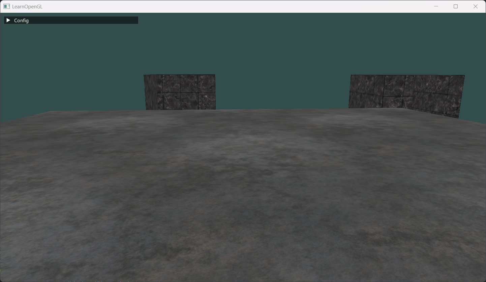
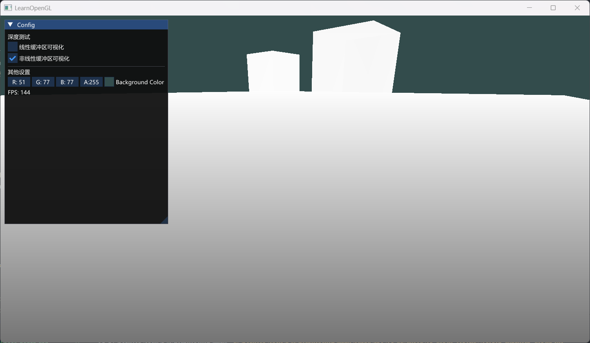
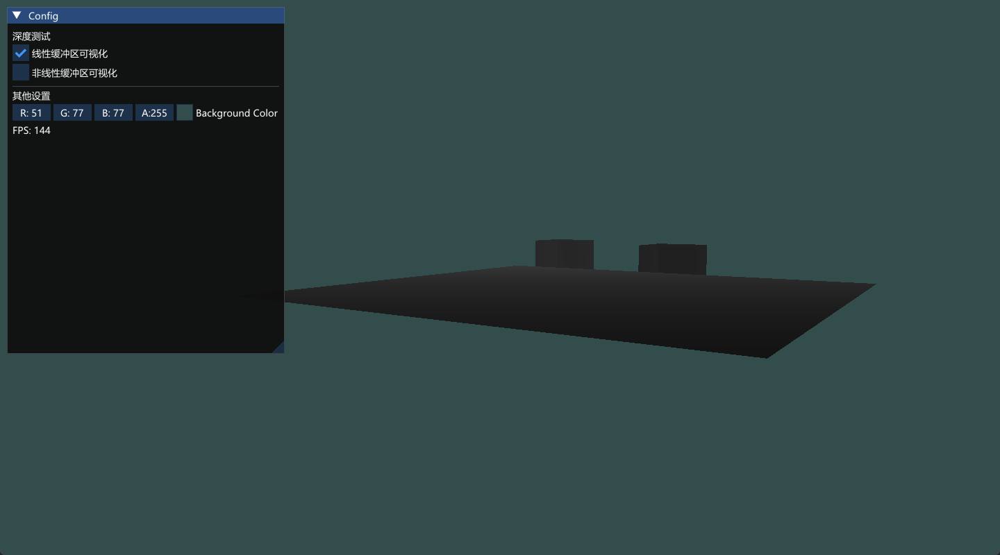
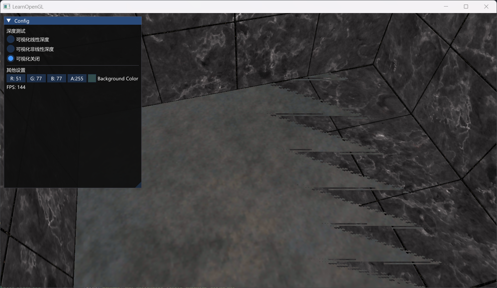

深度测试始终启用时：

屏幕空间的深度缓冲可视化（非线性）：

屏幕空间的深度缓冲可视化（线性）：

z-buffer:

z-buffer的本质：两个图形投影后得到的片元，在深度缓冲区的数值过于接近（小于深度缓冲区的float24能分辨的精度）。
注：投影的非线性使得，屏幕空间中的数值大部分区间（比如0~0.7）对应着相机空间中少量靠近近平面的区间（如10~50），这部分区间可表达的数字更多（精度更高）。所以靠近远平面的区间更容易发生z-buffer，即使二者设置的z不同，也容易出现非常靠近导致投影后深度缓冲值由于精度不足而相同。