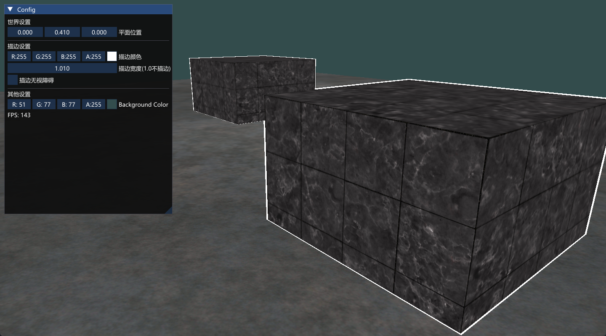
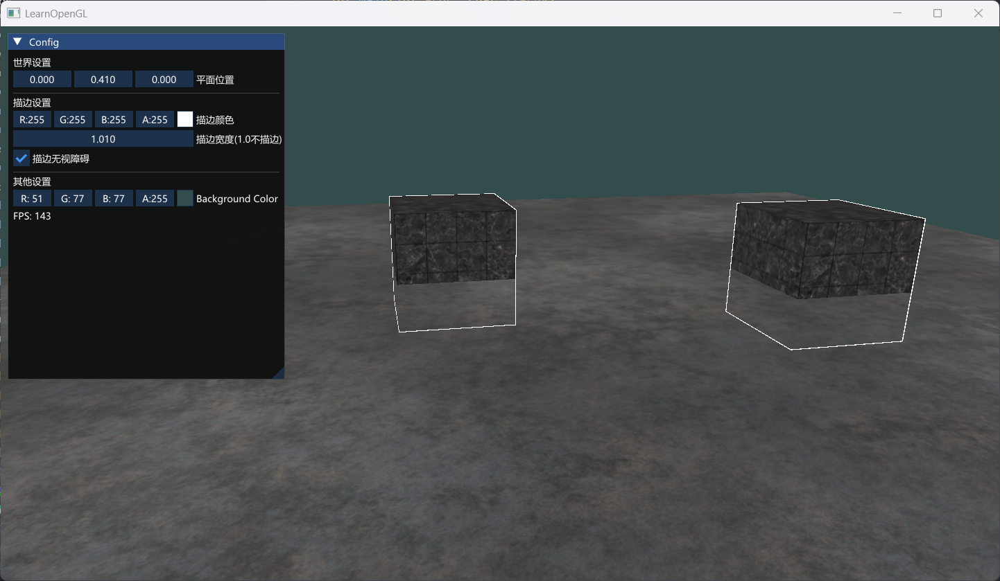

## 
```C++
// 模板测试
glEnable(GL_STENCIL_TEST);

//清除模板缓冲
glClear(GL_STENCIL_BUFFER_BIT);

// 模板测试函数(控制比较)
glStencilFunc(GLenum func, GLint ref, GLuint mask);
    // func，如GL_ALWAYS
    // ref，模板测试的参考值，与缓冲值比较。如ref < stencil_buffer_value
    // mask，比较前缓冲值与ref值先与mask进行AND运算，默认mask全1

// 模板操作（控制模板和深度测试通过和失败后的行为）
glStencilOp(GLenum sfail, GLenum dpfail, GLenum dppass);
    //sfail：模板测试失败时采取的行为。
    //dpfail：模板测试通过，但深度测试失败时采取的行为。
    //dppass：模板测试和深度测试都通过时采取的行为。

// 模板掩码（控制写入，包括clear）
glStencilMask(0xFF); // 每一位写入模板缓冲时都保持原样
glStencilMask(0x00); // 每一位在写入模板缓冲时都会变成0（禁用写入，只读） GL_FLASE = 0x00
```

##
测试函数	描述
GL_ALWAYS	永远通过模板测试
GL_NEVER	永远不通过模板测试
GL_LESS	在参考值小于缓冲的模板值时通过测试
GL_EQUAL	在参考值等于缓冲区的模板值时通过测试
GL_LEQUAL	在参考值小于等于缓冲区的模板值时通过测试
GL_GREATER	在参考值大于缓冲区的模板值时通过测试
GL_NOTEQUAL	在参考值不等于缓冲区的模板值时通过测试
GL_GEQUAL	在参考值大于等于缓冲区的模板值时通过测试

## 
测试通过或失败时的写入行为	描述
GL_KEEP	保持当前储存的模板值（默认全为KEEP，即无论通过与否，不改变缓冲值）
GL_ZERO	将模板值设置为0
GL_REPLACE	将模板值设置为glStencilFunc函数设置的ref值
GL_INCR	如果模板值小于最大值则将模板值加1
GL_INCR_WRAP	与GL_INCR一样，但如果模板值超过了最大值则归零
GL_DECR	如果模板值大于最小值则将模板值减1
GL_DECR_WRAP	与GL_DECR一样，但如果模板值小于0则将其设置为最大值
GL_INVERT	按位翻转当前的模板缓冲值
8位，256个值
作用：外轮廓描边

## 结果
普通描边：

无视障碍描边：
