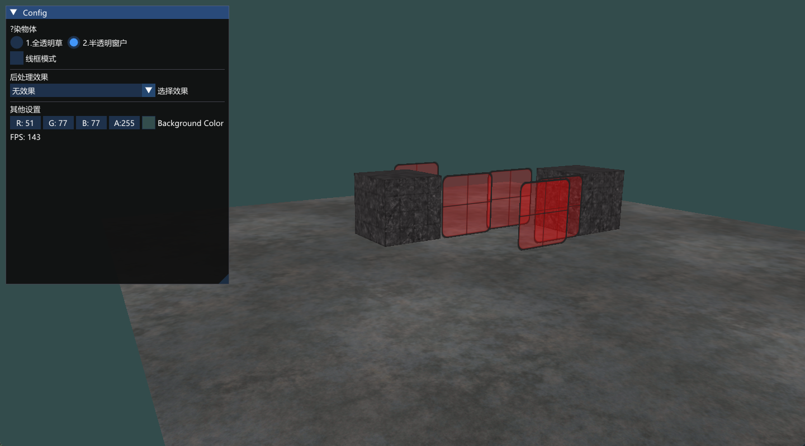
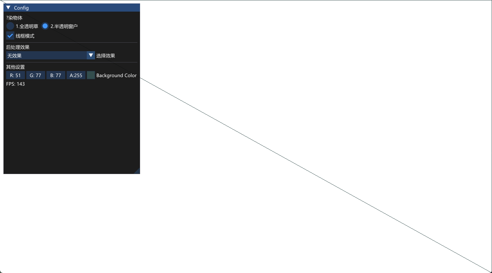
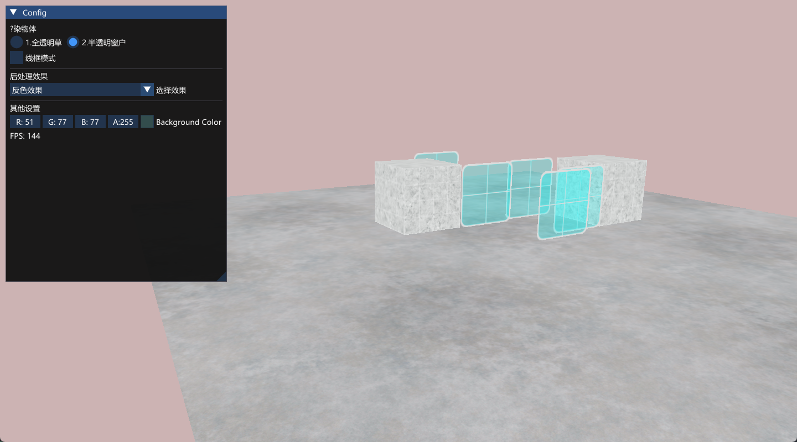
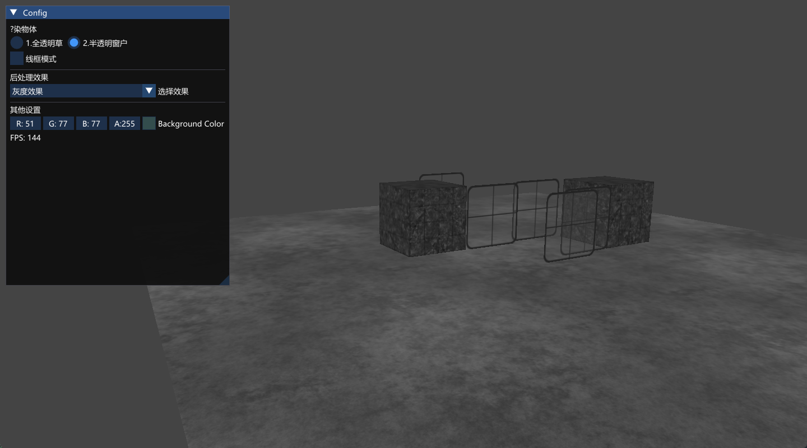
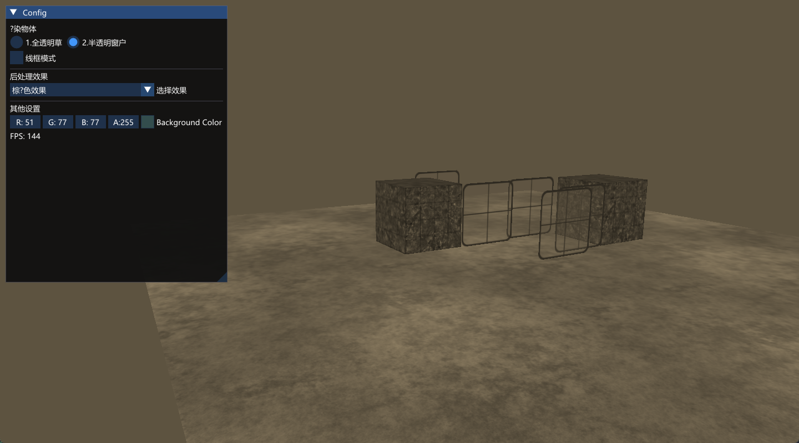
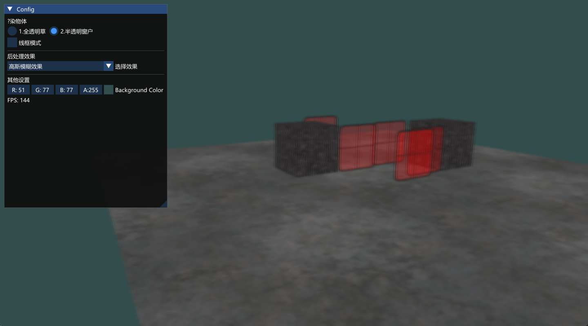
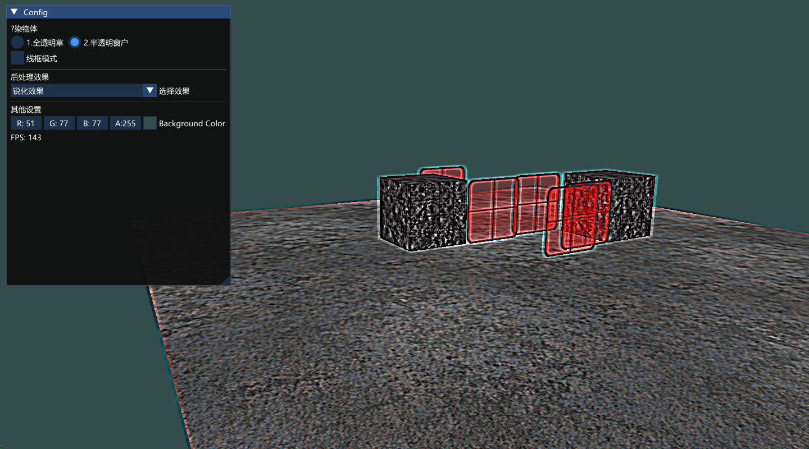
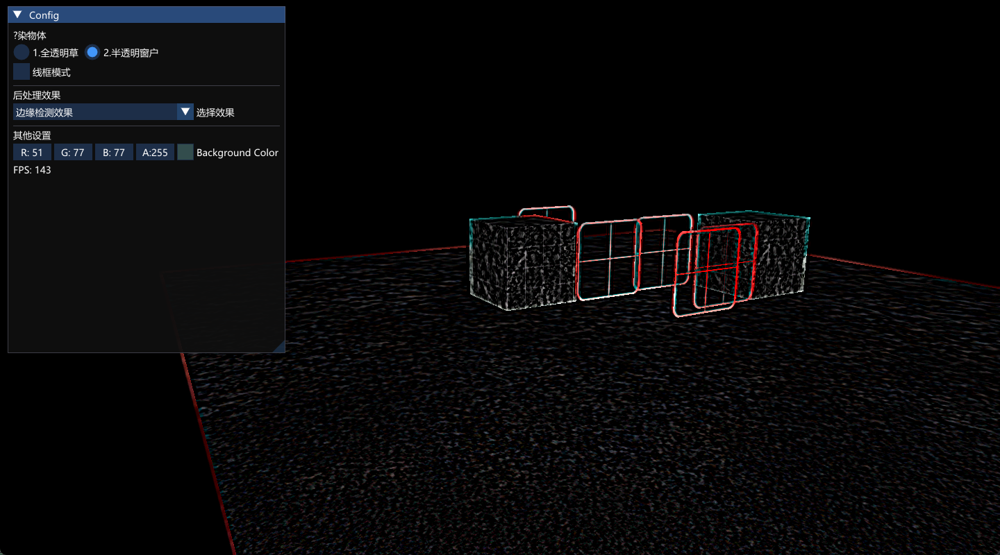

# 使用fbo渲染原理
将新的帧缓冲绑定为激活的帧缓冲，和往常一样渲染场景
绑定默认的帧缓冲
绘制一个横跨整个屏幕的四边形，将**帧缓冲的颜色缓冲**作为它的**纹理**。

# fbo完整性检查
FBO 的“完整性检查”就是调用
`GLenum status = glCheckFramebufferStatus(GL_FRAMEBUFFER);`
让 OpenGL 按官方规则把当前绑定的 FBO 检查一遍，只有返回 GL_FRAMEBUFFER_COMPLETE 才允许后续渲染，否则任何 draw 命令都会被直接忽略。
检查项目（任一不合格即判“不完整”）：
1. 附件完整性
- 颜色、深度、模板附件不能“空绑”（0 句柄或宽度/高度为 0）。
- 颜色附件必须是“颜色可渲染格式”（如 RGBA8），深度附件必须是“深度可渲染格式”（如 D24S8），不能张冠李戴。
2. 整体完整性
- 至少得有一个附件“有图”。
- glDrawBuffers 指定的输出槽必须真的挂有图像。
- 同一 FBO 里所有附件的 宽高必须相同（含样本数，多重采样纹理必须与同类多重采样深度缓冲配对）。
- 驱动必须同时支持这套格式组合（极老显卡可能对浮点颜色+深度组合不支持）。

> 允许仅有一个颜色附件

# 效果图
无效果：

线框：

反色：

灰度：

复古棕褐色：

高斯模糊：

锐化：

边缘检测；
