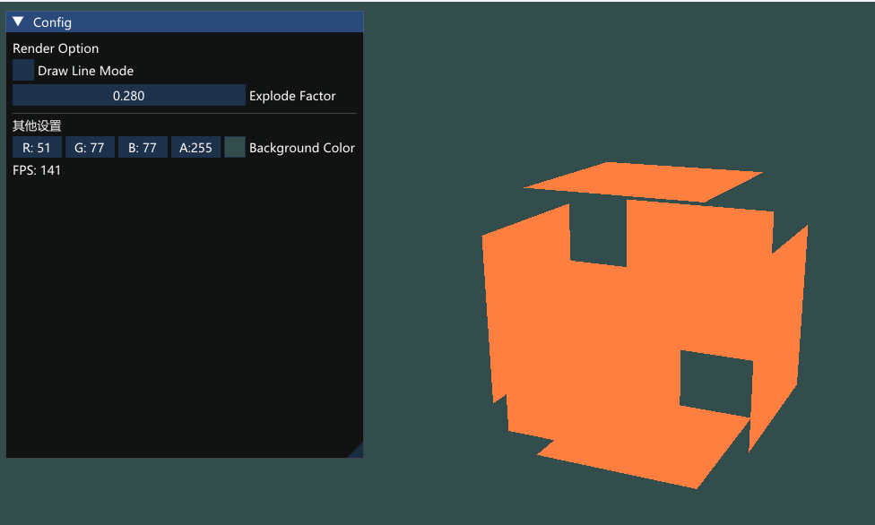
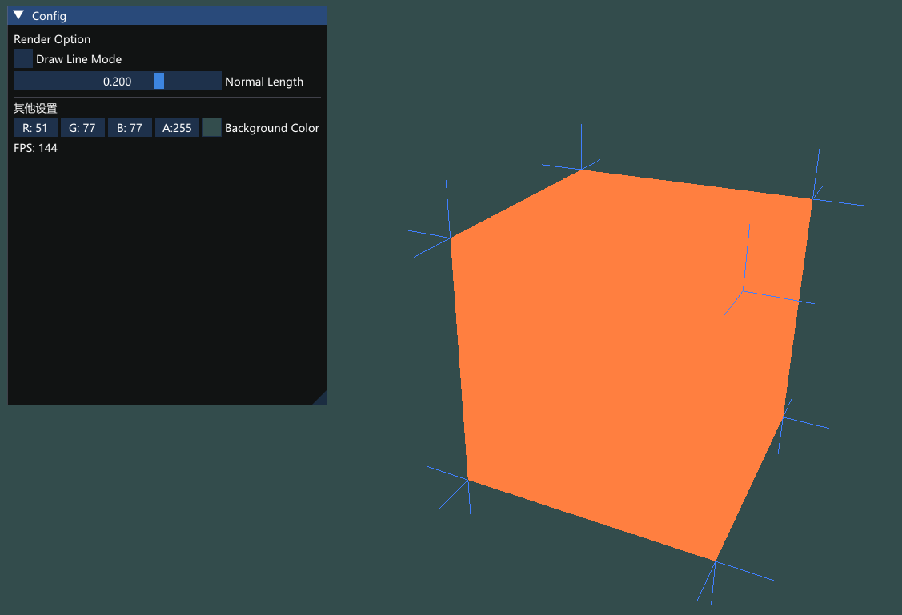

## 几何着色器

**基本结构**
```glsl
#version 430 core
layout (points) in; 
layout (line_strip, max_vertices = 2) out;

void main() {    
    gl_Position = gl_in[0].gl_Position + vec4(-0.1, 0.0, 0.0, 0.0); 
    EmitVertex(); // 在gl_Position位置发射一个顶点

    gl_Position = gl_in[0].gl_Position + vec4( 0.1, 0.0, 0.0, 0.0);
    EmitVertex(); // 发射一个顶点

    EndPrimitive(); // 根据上述发射的顶点完成一个图元绘制
}

```
**in**
对于`in`:取决于drawcall时的设置,括号为对应的一个图元所包含的最小顶点数
points：绘制GL_POINTS图元时（1）。
lines：绘制GL_LINES或GL_LINE_STRIP时（2）
lines_adjacency：GL_LINES_ADJACENCY或GL_LINE_STRIP_ADJACENCY（4）
triangles：GL_TRIANGLES、GL_TRIANGLE_STRIP或GL_TRIANGLE_FAN（3）
triangles_adjacency：GL_TRIANGLES_ADJACENCY或GL_TRIANGLE_STRIP_ADJACENCY（6）

**out**
对于`out`:
类型:
- points
- line_strip
- triangle_strip
还需要设置最多绘制的顶点数,多了会抛弃

**内建变量**
可以自动访问从vert传来的`gl_in`数组(包含`gl_Position`等顶点数据),数组存储了一个图元的全部顶点

## 结果
爆炸:



可视化法线:
