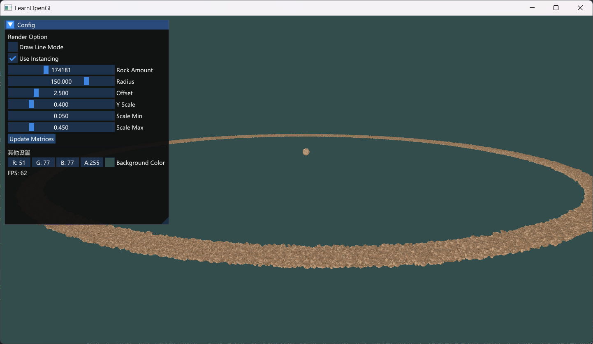

# 实例化数组
为什么用：uniform限制数据上限，大量实例数据时需要换用其他方式。
本质上就是一块普通的顶点缓冲对象（VBO）

需要使用`glVertexAttribDivisor(index, 1)`告诉 OpenGL：
这个属性每个实例更新一次，而不是每个顶点更新一次。(结合glDrawArraysInstanced使用)

divisor 的值决定了更新频率：
0 → 每个顶点（默认）
1 → 每个实例
2 → 每 2 个实例 … 以此类推

# 结果展示
小行星带
