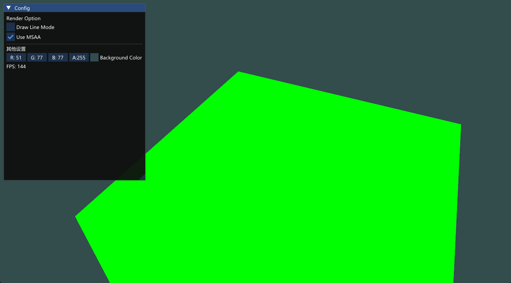
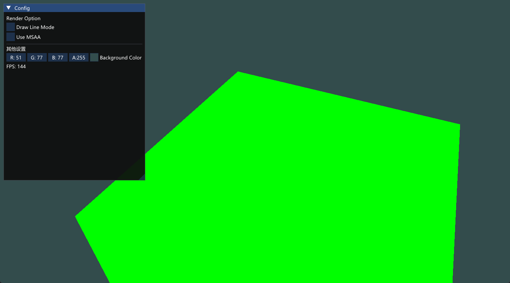

# 启用
glfwWindowHint(GLFW_SAMPLES, 4);
glEnable(GL_MULTISAMPLE);

# 离屏MSAA
使用fbo渲染特殊的多采样纹理和多采样rbo，但多重采样缓冲有一点特别，不能直接将它们的缓冲图像用于其他运算，比如在着色器中对它们进行采样。需要使用另一个fbo接收多采样的渲染结果。
```C++
glBindTexture(GL_TEXTURE_2D_MULTISAMPLE, tex);
glTexImage2DMultisample(GL_TEXTURE_2D_MULTISAMPLE, samples, GL_RGB, width, height, GL_TRUE);

glFramebufferTexture2D(GL_FRAMEBUFFER, GL_COLOR_ATTACHMENT0, GL_TEXTURE_2D_MULTISAMPLE, tex, 0);

glRenderbufferStorageMultisample(GL_RENDERBUFFER, 4, GL_DEPTH24_STENCIL8, width, height);

// 渲染fbo
// ...

// 转移到另一个普通纹理和rbo的fbo上
glBindFramebuffer(GL_READ_FRAMEBUFFER, multisampledFBO);
glBindFramebuffer(GL_DRAW_FRAMEBUFFER, intermediateFBO);
glBlitFramebuffer(0, 0, width, height, 0, 0, width, height, GL_COLOR_BUFFER_BIT, GL_NEAREST);

```

1. 将新的帧缓冲绑定为激活的帧缓冲，和往常一样渲染场景
2. blit到中间fbo
3. 绑定默认的帧缓冲
4. 绘制一个横跨整个屏幕的四边形，将中间fbo的颜色缓冲作为它的纹理。

# Results
w msaa


w/o msaa
